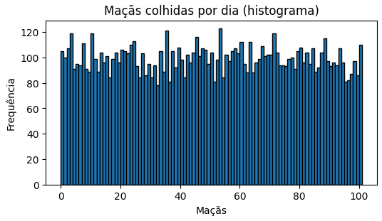
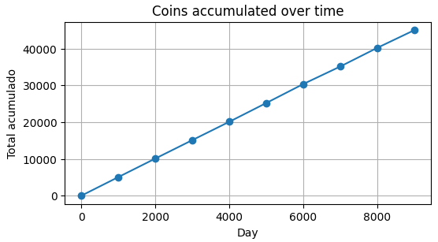
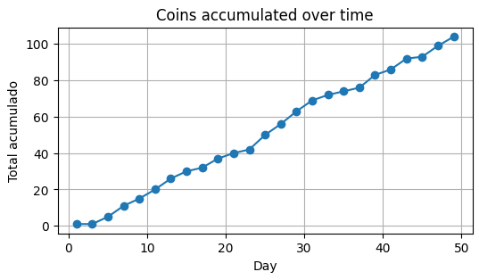

#### Challenge 1 — Histogram of Random Data
 

A farmer wants to see the distribution of apples harvested per day.  
The code below generates random numbers representing the number of apples per day and plots a histogram.

**-> Change only the variables `num_dias`, `min_val`, and `max_val` to observe how the shape of the histogram changes.**

**Objective:** understand how input parameters affect the visualized distribution.

---

#### Solution:
 

**What happens when we change the time (days)?**

Fixing *n = 100*, we see that the distributions follow with a discrepant variation.

However, when testing:

*N = 1000*  
*Random apple interval per day* = [0, 20]

*N = 10000*  
*Random apple interval per day* = [0, 20]

It is easy to see that the distribution becomes *uniform*, and this happens because the `random` library follows a *uniform distribution* for each value in the defined *range*, so for large *n*, the variance becomes negligible, while the graph begins to *flatten*.

This occurs because the *theoretical distribution is uniform* — the function `random.randint(0, 20)` was designed to generate numbers from a *discrete uniform distribution*.  
This means that, theoretically, each of the *k* possible outcomes (positive integer values between 1 and *k*) has exactly the same probability of being chosen in any draw.

The probability *P* is given by the following formula:

$$
P = \frac{i}{k}
$$

Where:
- *i* = Number of apples generated.  
- *k* = Sample space (interval size).

Thus, when the number of days (*n*) is small (such as *n = 100*), we are working with a small sample.  
In small samples, sampling variability (the discrepancy) has a greater impact.

Therefore, when we increase *n* (days), the *Law of Large Numbers* states that as the sample size (*n*) increases, the mean (or relative frequencies) of the observed results will converge to the theoretical expected value.  
Hence, as you increase *n* to *1000*, *10000*, ... random fluctuations begin to cancel out.  
The frequency with which each number (from 0 to 20) appears starts to get very close to its theoretical probability of *i/k*, resulting in the flattening appearance of the graph.

#### Relationship between the Apple Interval × Number of Days
Given the explanation for large *n*, the relationship of the apple interval is trivial:  
it follows that if there is a very high discrepancy between the number of apples and days, the theoretical distribution will reveal itself.

For example, using the same number of days as in analysis 3 (*n = 10000*), but now with a “closer” interval in scale:

*Interval* = 100  
*Days* = 10000

It is easy to see that the variance becomes more evident and impactful on the shape of the graph.

---
#### Challenge 2 - Timeline (Cumulative Sum)
 

As in the previous challenge, `random.randint(min_return, max_return)` follows a uniform distribution, meaning that each value in the interval has the same probability of occurring.

Thus, it is necessary to treat the daily return as the “mean”. Since we are dealing with random variables that follow a discrete uniform distribution, the mean is called the Expected Value *E(x)* and is given by:

$$E(X) = \sum x_i \cdot p_i$$

- Fixing the sample space: $\{0, 1, 2, ..., 10\}$ 
- Number of outcomes (*k*): 11  
- Probability of each outcome (*pᵢ*): $p_i = \frac{1}{11}$

The computation for the Expected Value *E(X)*, using the formal formula $E(X) = \sum x_i \cdot p_i$, is:

$$
E(X) = \left(0 \cdot \frac{1}{11}\right) + \left(1 \cdot \frac{1}{11}\right) + \left(2 \cdot \frac{1}{11}\right) + \dots + \left(10 \cdot \frac{1}{11}\right)
$$

Factoring out the common term $\frac{1}{11}$:

$$
E(X) = \frac{1}{11} \cdot (0 + 1 + 2 + \dots + 10)
$$

Knowing that the sum of the numbers from 0 to 10 is 55:

$$
E(X) = \frac{1}{11} \cdot (55)
$$

The final result is:

$$
E(X) = 5
$$

Therefore, according to the *Law of Large Numbers* discussed in Solution 1, it is guaranteed that the observed average of the returns is very close to the theoretical mean (in this case, 5), in addition to the graph gradually forming a straight line.

Thus, the relationship between the total expected return (*R* ), the number of days (*n*), and the expected daily value (*E(x)*) can be approximated by the following formula:

$$R \approx n \times E(x)$$

Where:
- *R* = The total accumulated return.  
- *n* = The number of days.  
- *E(x)* = The expected value of the gain for a single day.

*Gain interval: [0, 10] | Days: 10,000 | Plot every 1,000 days*

It is easy to see that for 10,000 days, the total return is very close to 50,000, which is precisely the result of

$$R \approx n \times E(x) \implies 50000 \approx 10000 \times 5$$

With a `plot = 1000` step, we will have 10 plots, each representing 1,000 days (and their corresponding cumulative total return).

Therefore, it is also notable that for every 2,000 days, each of these intervals is approximately equivalent to 10,000 in total return. Since we have 5 intervals of 2,000 days, then:

$$50000 \approx 5 \times 10000 \rightarrow 50000 \approx 50000$$

It is counterintuitive to realize, as in Solution 1, that for small `num_days`, there is greater discrepancy between the values, distorting the straight line that appears for large *n* (number of days).

*Gain interval: [0, 4] | Days: 50 | Plot every 2 days*

