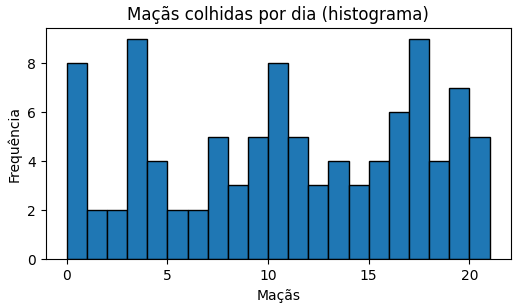
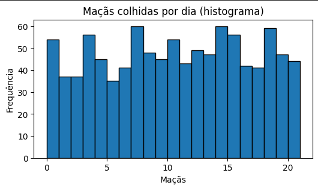
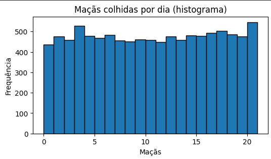

#### Challenge 1 — Histogram of Random Data
 

A farmer wants to see the distribution of apples harvested per day.  
The code below generates random numbers representing the number of apples per day and plots a histogram.

**-> Change only the variables `num_dias`, `min_val`, and `max_val` to observe how the shape of the histogram changes.**

**Objective:** understand how input parameters affect the visualized distribution.

---

#### Solution:
 

**What happens when we change the time (days)?**

Fixing *n = 100*, we see that the distributions follow with a discrepant variation.

However, when testing:

*N = 1000*  
*Random apple interval per day* = [0, 20]

*N = 10000*  
*Random apple interval per day* = [0, 20]

It is easy to see that the distribution becomes *uniform*, and this happens because the `random` library follows a *uniform distribution* for each value in the defined *range*, so for large *n*, the variance becomes negligible, while the graph begins to *flatten*.

This occurs because the *theoretical distribution is uniform* — the function `random.randint(0, 20)` was designed to generate numbers from a *discrete uniform distribution*.  
This means that, theoretically, each of the *k* possible outcomes (positive integer values between 1 and *k*) has exactly the same probability of being chosen in any draw.

The probability *P* is given by the following formula:

$$
P = \frac{i}{k}
$$

Where:
- *i* = Number of apples generated.  
- *k* = Sample space (interval size).

Thus, when the number of days (*n*) is small (such as *n = 100*), we are working with a small sample.  
In small samples, sampling variability (the discrepancy) has a greater impact.

Therefore, when we increase *n* (days), the *Law of Large Numbers* states that as the sample size (*n*) increases, the mean (or relative frequencies) of the observed results will converge to the theoretical expected value.  
Hence, as you increase *n* to *1000*, *10000*, ... random fluctuations begin to cancel out.  
The frequency with which each number (from 0 to 20) appears starts to get very close to its theoretical probability of *i/k*, resulting in the flattening appearance of the graph.

#### Relationship between the Apple Interval × Number of Days
 

Given the explanation for large *n*, the relationship of the apple interval is trivial:  
it follows that if there is a very high discrepancy between the number of apples and days, the theoretical distribution will reveal itself.

For example, using the same number of days as in analysis 3 (*n = 10000*), but now with a “closer” interval in scale:

*Interval* = 100  
*Days* = 10000

It is easy to see that the variance becomes more evident and impactful on the shape of the graph.
